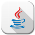
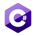

### Hi, I'm Rasoul
[🔷 Linkedin Profile](https://www.linkedin.com/in/rasoulkhaksari)
 
Senior Software Engineer with experienced in all aspects of the software development life-cycle and end-to-end project management, from concept through to development and delivery. 
Hands-on experience to different Programming paradigms such as Object-oriented, Functional, Defensive, Reactive, Concurrent,
Microservices, Test Driven, Domain Driven, Event Driven. 
Motivated data scientist. Passionate about building models that fix problems. Relevant skills include machine learning, data mining, programming.

---

💼 **Toolbox**
 
    

<!--
**Toolbox**
 **Toolbox**
**rasoulkhaksari/rasoulkhaksari** is a ✨ _special_ ✨ repository because its `README.md` (this file) appears on your GitHub profile.

Here are some ideas to get you started:

- 🔭 I’m currently working on ...
- 🌱 I’m currently learning ...
- 👯 I’m looking to collaborate on ...
- 🤔 I’m looking for help with ...
- 💬 Ask me about ...
- 📫 How to reach me: ...
- 😄 Pronouns: ...
- ⚡ Fun fact: ...
-->
