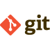

### Hi, I'm Rasoul
[🔷 Linkedin Profile](https://www.linkedin.com/in/rasoulkhaksari)
 
Senior Software Engineer with experienced in all aspects of the software development life-cycle and end-to-end project management, from concept through to development and delivery. 
Hands-on experience to different Programming paradigms such as Object-oriented, Functional, Defensive, Reactive, Concurrent,
Microservices, Test Driven, Domain Driven, Event Driven. 
Motivated data scientist. Passionate about building models that fix problems. Relevant skills include machine learning, data mining, programming.

---

💼 **Toolbox**
 
   

---

💻 **Portfolio**
 
  🔷 [**Web Page Screenshot**](https://github.com/rasoulkhaksari/WebPage_Screenshot) 
  🔷 [**Simple Blockchain**](https://github.com/rasoulkhaksari/Simple_Blockchain) 
  🔷 [**Programming Algorithms**](https://github.com/rasoulkhaksari/Programming_Algorithms) 
  🔷 [**CQRS pattern**](https://github.com/rasoulkhaksari/CQRS_pattern) 
  🔷 [**Natural Language Processing Chatbot**](https://github.com/rasoulkhaksari/Natural_Language_Processing_Chatbot) 
  🔷 [**Stock Price Prediction**](https://github.com/rasoulkhaksari/Stock_Price_Prediction) 
  🔷 [**Twitter Sentiment Analysis**](https://github.com/rasoulkhaksari/Twitter_Sentiment_Analysis) 
  🔷 [**Software Design Patterns**](https://github.com/rasoulkhaksari/Software_Design_Patterns) 

<!--
**Toolbox**
 **Toolbox**
**rasoulkhaksari/rasoulkhaksari** is a ✨ _special_ ✨ repository because its `README.md` (this file) appears on your GitHub profile.

Here are some ideas to get you started:

- 🔭 I’m currently working on ...
- 🌱 I’m currently learning ...
- 👯 I’m looking to collaborate on ...
- 🤔 I’m looking for help with ...
- 💬 Ask me about ...
- 📫 How to reach me: ...
- 😄 Pronouns: ...
- ⚡ Fun fact: ...
-->
